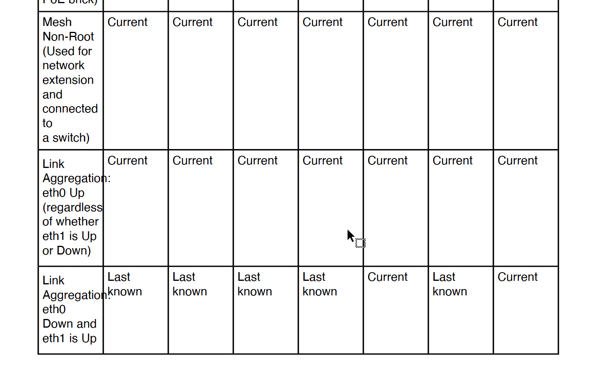

Validate PDF
============

Scans your PDF and checks for PDF metadata, links, and overflowing table cells.

**Input:** PDF output of the guide.

Validate Links
--------------

Checks for external hyperlinks and validates them. Identifies redirected, invalid, and unreachable links, logging results with page references.

**Example Output:**

*   Redirected: http://example.com → http://new-url.com (Page 3)
    
*   Invalid: http://broken.com (Status: 404, Page 5)
    
*   Unreachable: http://timeout.com (Timeout, Page 7)
    

Large PDFs with many links may take several minutes to process.

Validate Tables
---------------

Scans the entire PDF for cells with overflowing content.

**Example:**   

**Note:** Large PDFs may take up to 5 minutes to process.
